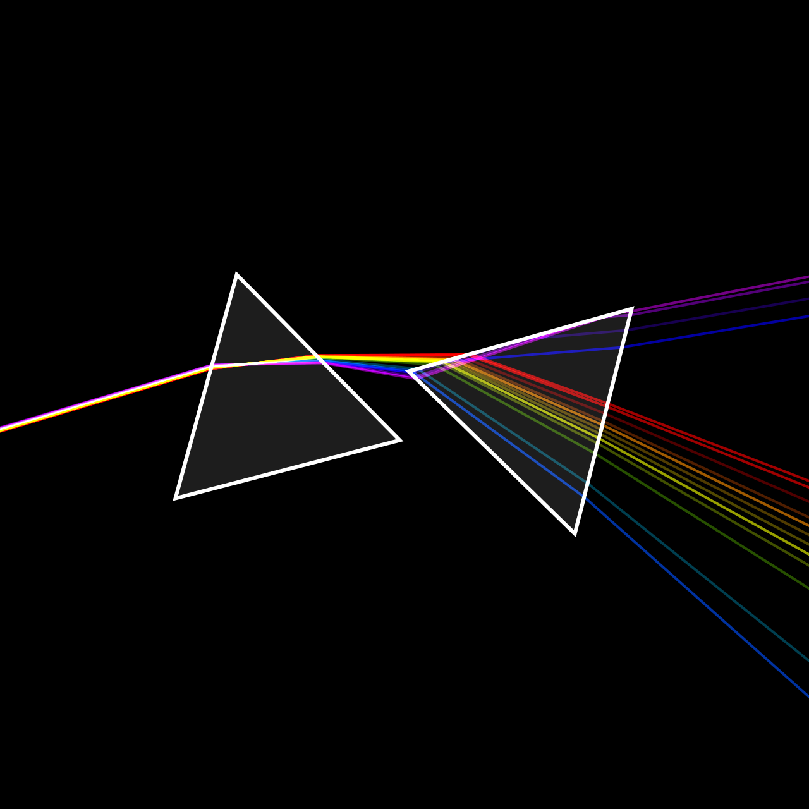
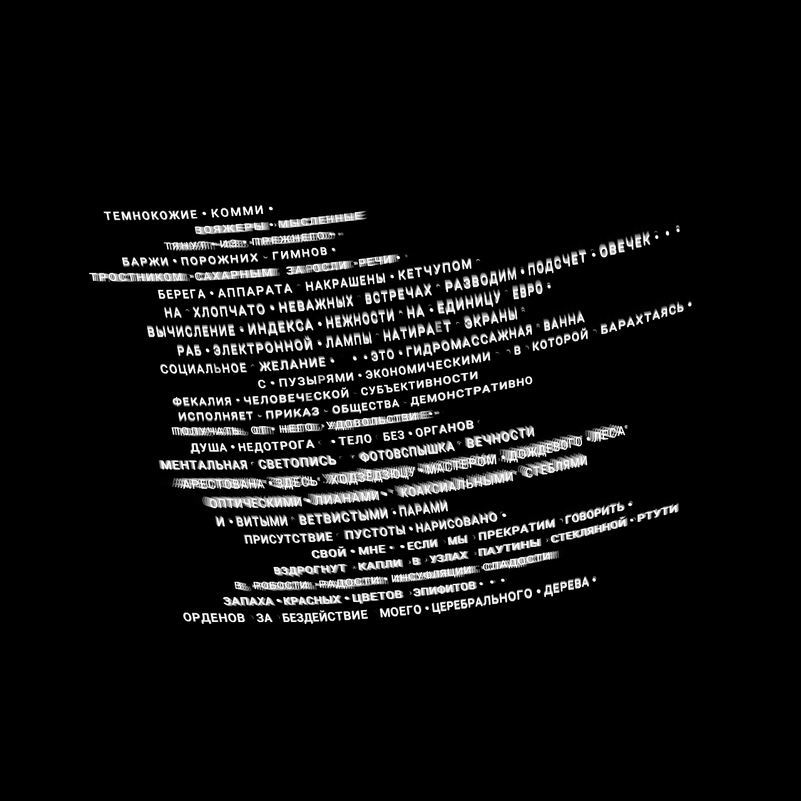

# Random examples of procedural art
Made with [processing.org](https://processing.org) etc.

### Snowcode 
aesthetically attractive 
graphical data coding system similar in a way to QR-codes [More details->...](/snowflakes/README.md)

### 2 prizmis 
[details..](/prizms)

See it animated: [https://www.instagram.com/p/B7VBaqdFolx](https://www.instagram.com/p/B7VBaqdFolx/?utm_source=github)

 
### Texts 
[details..](/opart_19_poem)

See it animated: [https://www.instagram.com/p/B7Q5uzdFQTb](https://www.instagram.com/p/B7Q5uzdFQTb/?utm_source=github)

### lorenz transformations 
[find this animated on Instangram..](https://www.instagram.com/p/B7Lg_S-FHzr/)  

  

