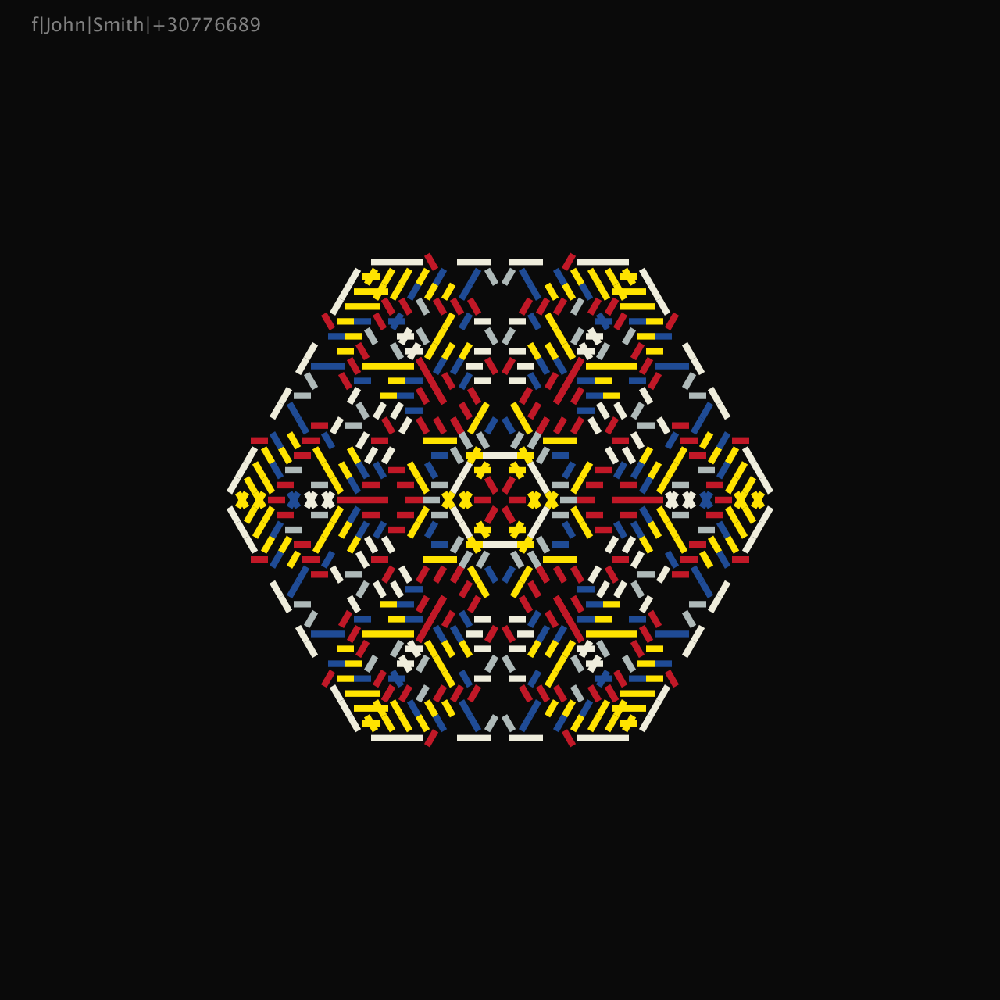
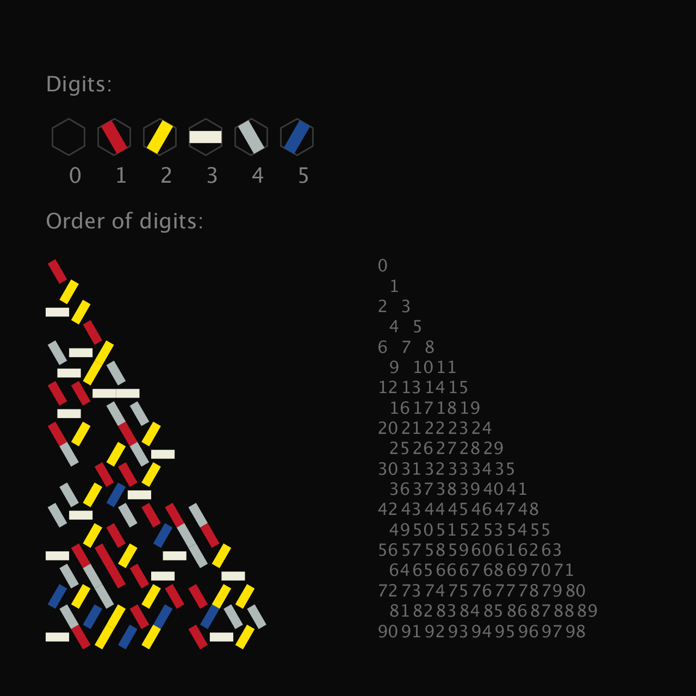

# Snowcode

The aim of this project is to build an aesthetically attractive graphical data coding system similar in a way to QR-codes.

The triangular segment of the hexagonal grid was selected as the structure for placing the numbers.

Data is converted to hexadecimal representation, so we have 6 digits. 
Graphically, a digit can be encoded in one of 6 colors and / or as a combination of 3 different rotations X two colors.

Triangles (or sectors) are organized by rotation and reflection into a hexagonal structure, similar to a snowflake.
Thus, the data is duplicated 12 times. This level of redundancy minimizes the error rate of a recognition system.
 

