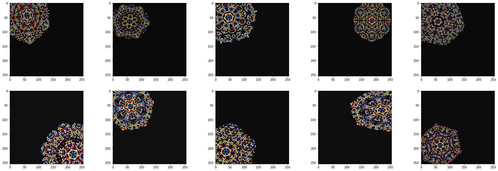

<!-- meh -->

<canvas id="myCanvas" resize></canvas>

# Snowcode

The aim of this project is to build an aesthetically attractive graphical data coding system similar in a way to QR-codes.

## Encoding, the idea

Data is converted to hexadecimal representation, so we have 6 digits. 
Graphically, a digit is encoded in one of 6 colours and / or as a combination of 3 different rotations X two colors.

The triangular segment of the hexagonal grid was selected as the structure for placing the digits.

Triangles (or sectors) are organised by rotation and reflection into a hexagonal structure, similar to a snowflake.
Thus, the data is duplicated 12 times. This level of redundancy minimises the error rate of a recognition system.
 
## Decoding, or recognition

We've created the Tensoflow / Keras ML model on top of EfficientNet to test the theoretical possibility of data recovery using a neural network (POC).

We've trained the POC model on artificially heavily damaged images in a rather low resolution of 256 x 256 pixels.

- Samples of deteriorated images

### Preliminary results
The results are very promising.
It is almost obvious that a deeply trained network is able to cope with the task with very high accuracy (there is 17M parameters in POC model).

However, intuition suggests that the number of layers and parameters can be very greatly reduced. There is still work to be done.

For details, have a look at this Colab Notebook:
(Https://colab.research.google.com/github/compartia/creative/blob/master/snowflakes/notebooks/snowcode_recogition.ipynb)
[github: notebooks/snowcode_recogition.ipynb](notebooks/snowcode_recogition.ipynb)
 
 
  

# Appendix 1: More samples

# Appendix 2: JS encoding implementation

